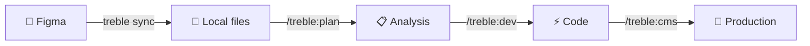
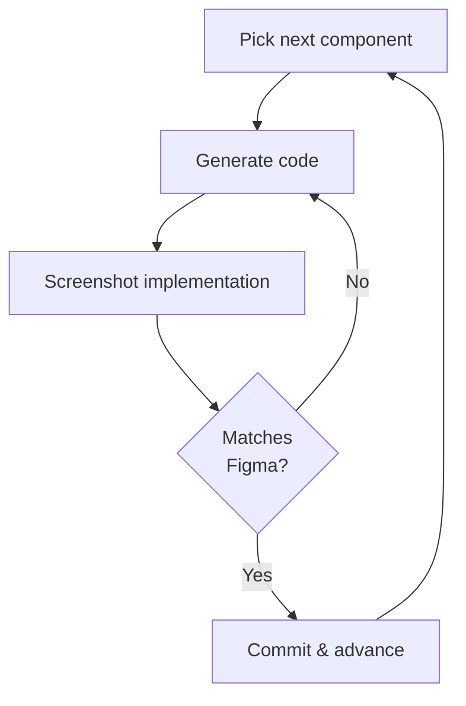

# treble

Figma to production code. Syncs your design to disk, analyzes it with AI, builds every component, and visually verifies the result — all from your terminal.

```bash
npm install -g @treble-app/cli
```

## How it works



1. **`treble sync`** pulls your Figma frames to disk — screenshots, layer trees, and visual properties. No API calls after the first sync.
2. **`/treble:plan`** reads the synced data and produces a component inventory with design tokens, build order, and responsive rules.
3. **`/treble:dev`** classifies your design, picks the right stack, scaffolds the project, and runs the build loop.
4. **`/treble:cms`** wires up content editability — Sanity, Prismic, or WordPress.

### The build loop

Each component goes through a code → review → fix cycle until it matches the Figma reference:



The output is a real project — `npm run dev` works, components match the Figma design, and the code follows feature-based architecture.

## Quick start

### 1. Install the CLI

```bash
npm install -g @treble-app/cli
```

Or run without installing:

```bash
npx @treble-app/cli --help
```

### 2. Install the Claude Code plugin

The CLI syncs your Figma data. The Claude Code plugin does the AI analysis and code generation. You need both.

In [Claude Code](https://claude.ai/code):

```
/install-plugin treble-app/treble-cli
```

### 3. Authenticate with Figma

```bash
treble login --pat
```

This stores your token in `~/.treble/config.toml` (never in your project directory).

### 4. Initialize a project

```bash
mkdir my-site && cd my-site
treble init "https://www.figma.com/design/abc123/My-Design"
```

This creates `.treble/config.toml` with your Figma file key.

### 5. Sync your design

```bash
treble sync
```

Interactive mode — pick which frames to sync:

```bash
treble sync -i
```

After syncing, your `.treble/figma/` directory contains everything: reference screenshots, full layer trees with visual properties, and section-level snapshots. Zero API calls from this point on.

### 6. Plan and build (in Claude Code)

```
/treble:plan          # Analyze → writes analysis.json + build-state.json
/treble:dev           # Classify → pick stack → scaffold → build all components
/treble:cms           # Wire up CMS (Sanity, Prismic, or WordPress)
```

## CLI reference

```bash
treble login --pat                       # Store Figma personal access token
treble login                             # OAuth via treble.build (if available)
treble init "FIGMA_URL_OR_KEY"           # Initialize .treble/ in current directory
treble sync                              # Pull all Figma frames to disk
treble sync -i                           # Interactive frame picker
treble sync --frame "Contact"            # Sync one frame by name
treble sync --page "Homepage"            # Sync all frames from one page
treble sync --force                      # Re-sync even if already cached
treble tree "Contact"                    # Layer outline (top-level)
treble tree "Contact" --depth 3          # Layer outline (3 levels deep)
treble tree "Contact" --verbose          # With fills, fonts, layout, radius
treble tree "Contact" --root "55:1234"   # Subtree from a specific node
treble tree "Contact" --root "55:1234" --json  # Machine-readable output
treble show "NavBar" --frame "Contact"   # Render a node as PNG
treble show "55:1234"                    # Render by node ID
treble extract                           # Extract image assets from synced frames
```

## Plugin commands

These run inside Claude Code with the treble plugin installed:

| Command | What it does |
|---------|-------------|
| `/treble:plan` | Analyze synced Figma data → component inventory, design tokens, build order |
| `/treble:dev` | Classify design → pick stack → scaffold → build loop with visual review |
| `/treble:cms` | Wire up CMS editability (Sanity, Prismic, or WordPress) |
| `/treble:tree` | Interactive layer outline explorer |
| `/treble:show` | Render a specific Figma node as a screenshot |
| `/treble:compare` | Visual comparison between Figma reference and implementation |

## Supported stacks

**Deployment targets** (chosen during `/treble:dev`):

| Target | UI Library | Best for |
|--------|-----------|----------|
| Next.js | shadcn/ui + Tailwind | Apps, marketing sites, e-commerce — works for everything |
| Astro | shadcn/ui + Tailwind | Content-heavy sites, blogs, portfolios |
| WordPress | Basecoat + Tailwind | WordPress hosting, existing WP infrastructure |

**CMS integrations** (wired during `/treble:cms`):

| CMS | Works with | Setup |
|-----|-----------|-------|
| Sanity | Next.js, Astro | TypeScript schemas, embedded Studio |
| Prismic | Next.js, Astro | Slice Machine, slice-based editing |
| WordPress | WordPress | Gutenberg blocks, ACF fields |

## What gets synced to disk

```
.treble/
├── config.toml              # Figma file key
├── analysis.json            # AI analysis output (components, design system, build order)
├── build-state.json         # Build progress + deployment config
└── figma/
    ├── manifest.json        # Frame inventory
    └── {frame-slug}/
        ├── reference.png    # Full frame screenshot
        ├── nodes.json       # Complete layer tree with visual properties
        ├── sections/        # Section-level screenshots
        └── snapshots/       # On-demand screenshots
```

All Figma data lives on disk after `treble sync`. The AI agents read local files — no API calls during planning or building.

## CLI without the plugin

The CLI works standalone as a Figma development tool:

- `treble sync` — snapshot your design to disk
- `treble tree` — inspect layer hierarchy with visual properties
- `treble show` — render any node as a PNG
- `treble extract` — pull image assets

You just won't get the AI-powered analysis and code generation.

## Plugin without the CLI

The plugin needs the CLI to access Figma data. If the CLI isn't installed, the plugin will warn you on session start:

```
WARNING: treble CLI not found. Install it: npm install -g @treble-app/cli
```

## Requirements

- Node.js 18+
- [Claude Code](https://claude.ai/code) (for the plugin)
- A Figma account with a [personal access token](https://www.figma.com/settings)

## License

MIT
